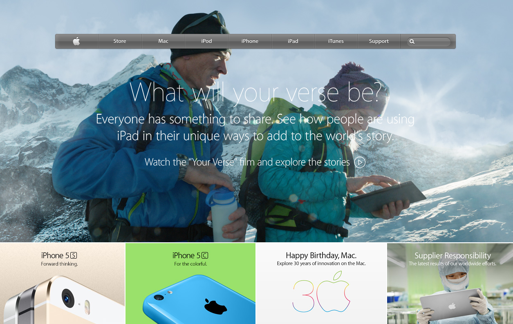

# Building with Backgrounds and Gradients project: Apple homepage clone from 2014

> This is an Apple homepage clone using HTML and CSS3 from the web archive.

## Screenshots of website

The project is built using Html and Css with an extensive use of the gradient background css properties.

## Built With

- HTML
- CSS3
- Font awesome icons

## Live Demo

[Live Demo Link](https://raw.githack.com/liraD/microverse-apple-mockup/feature-layout/index.html)

## To get a local copy up and running follow these simple example steps.

### Setup

Clone the project locally.

### Linters

1. run `npm install`.
2. run `npm run test` to check the Html and Css files.

### Deployment

Install and run a live server plugin on you IDE/Text editor and run it from the root directory.

## Authors

👤 **Cristian Viorel Ceamatu**

- Github: [@githubhandle](https://github.com/cristianCeamatu)
- Twitter: [@twitterhandle](https://twitter.com/CeamatuV)
- Linkedin: [linkedin](https://www.linkedin.com/in/ceamatu-cristian-viorel-7a5469136/)

👤 **Diego Lira**

- Github: [@githubhandle](https://github.com/lirad)
- Twitter: [@twitterhandle](https://twitter.com/lirad)
- Linkedin: [linkedin](https://www.linkedin.com/in/diegoalira/)

## Show your support

Give a ⭐️ if you like this project!

## 📝 License

This project is [MIT](lic.url) licensed.
